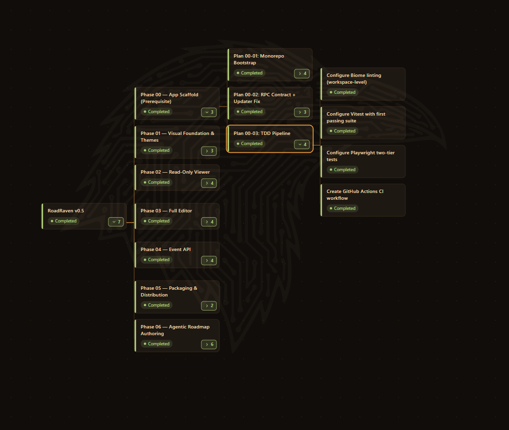
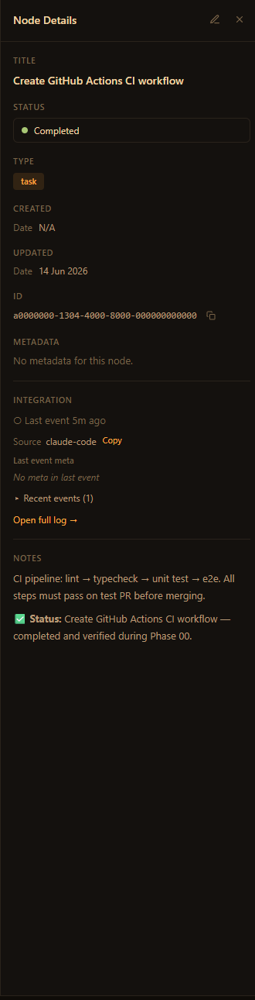
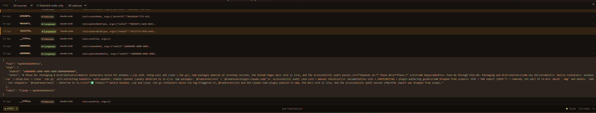

# RoadRaven

[](./LICENSE)
[](#feature-status)
[](#install)

**Your plan. Watching itself.**

A keyboard-first desktop editor for visual roadmap trees — backed by a plain JSON
file you own. Wire each node to something real (an AI agent, a CI pipeline, a local
script) and watch status update live over WebSocket. No sprints, no story points,
no cloud, no accounts. It's just a file, living in your repo.

> Built on **Electrobun** (not Electron). Runtime is **Bun**.

> ⚠️ **Alpha (v0.5).** RoadRaven is an early public release. Core editing and the
> live Event API work today, but expect rough edges — the data format, APIs, and
> packaging may still change before v1.0. Bug reports and feedback are very welcome.

## Demo



Inspect any node in the side panel — status, type, metadata, markdown notes, and the live event feed:



<!-- TODO(public-launch): a demo video is in production — drop the embed/link here when ready. -->

> 🎬 _Demo video coming soon._

---

## Why RoadRaven

Imagine you have an idea. You sketch it as a tree, name the pieces, set your own
statuses — the plan is yours, with no opinions baked in. Then you connect each node
to whatever is actually running, and the tree keeps itself current.

- **🌳 Plan-as-file** — your roadmap is plain `roadmap.json`, living in your repo. Diffable, reviewable, yours. No database, no proprietary format.
- **📡 Live status from anything** — any process that can send a message updates a node. A GitHub Action finishes → the node turns green. Claude Code completes a task → the node updates. You don't touch a thing.
- **🤖 Built for agent supervision** — watch Claude Code work through your plan in real time via the [MCP integration](#use-with-claude-code-mcp).
- **🔒 Local-first** — binds to `127.0.0.1`, works air-gapped. Nothing leaves your machine. No accounts, no cloud, no subscription.
- **⌨️ Keyboard-first** — navigate and edit the entire tree without reaching for the mouse.
- **🎚️ Zero-opinion schema** — you define the statuses, types, and hierarchy. The app stays dumb; your tools do the talking.

---

## Install

> **This alpha (v0.5) ships Windows + Linux installers.** macOS is planned
> (see [Feature status](#feature-status) below).

Download the latest release from
[GitHub Releases](https://github.com/Shuffzord/RoadRaven/releases/latest).

### Windows

1. Download `stable-win-x64-RoadRaven-Setup.zip`.
2. Extract the `.zip`.
3. Double-click `RoadRaven-Setup.exe`.
4. **Windows SmartScreen will warn:** "Windows protected your PC."
   This is expected — RoadRaven ships unsigned in this alpha (no Authenticode
   certificate yet; code signing is planned for a later release). To install:
   - Click **More info**.
   - Click **Run anyway**.
5. Follow the installer prompts.

### Linux

1. Download `stable-linux-x64-RoadRaven-Setup.tar.gz`.
2. Extract and run the self-extracting installer:

   <!-- The extracted file is literally named `installer` (no extension). This is the
        Electrobun convention: see `electrobun/src/cli/index.ts` `createLinuxInstallerArchive`
        (~line 1680) which writes `installerPath = join(stagingDir, "installer")` with
        mode 0o755, plus the bundled README.txt that ships inside the archive instructing
        users to "Double-click the 'installer' file" or run "./installer". Verified
        against electrobun@1.18.1. If a future Electrobun version renames this binary,
        update both this section and `tests/release/installer-artifacts.test.ts`. -->
   ```bash
   tar -xzf stable-linux-x64-RoadRaven-Setup.tar.gz
   chmod +x ./installer        # ensure self-extractor is executable (per RESEARCH.md Pitfall 6)
   ./installer
   ```

   The archive extracts contents directly (no nested folder). The
   `chmod +x` step is required: Electrobun's `.tar.gz` bundle does not
   guarantee the executable bit on every Linux filesystem
   (cross-references RESEARCH.md Pitfall 6 — Linux launcher needs `+x`).
   The installer extracts the app to `~/.local/share/` and creates a
   desktop shortcut; the CEF runtime ships bundled (`bundleCEF: true`),
   so no system Chromium dependency is needed.

### Packages (for producers and library consumers)

> **Heads-up (alpha v0.5):** these npm packages are **not published yet** — they ship
> with the first tagged release. For now, clone the repo and build from source. The
> `bun add` / `bunx` commands below are how it will work once published. RoadRaven is
> **bun-first**, but these are plain npm packages, so any package manager works.

`@roadraven/core` — Zod schemas + types. Use this if you're building an Event Producer:

```bash
bun add @roadraven/core          # available once the first release is published
```

`@roadraven/plugin-claude-code` — the MCP wrapper that lets Claude Code (and any MCP
host) read, edit, and push live status updates to your roadmap. Until it's published,
build it locally — see [Use with Claude Code (MCP)](#use-with-claude-code-mcp) below.

See the [plugin authoring guide](docs/plugin-authoring.md) for the full Event API contract.

---

## Use with Claude Code (MCP)

**Why.** RoadRaven's headline use case is letting an AI agent author and maintain
your roadmap. `@roadraven/plugin-claude-code` is an MCP server exposing **19 tools**
so Claude Code can create, edit, move, and delete nodes — and push live status as it
works. Your plan becomes something the agent keeps current for you.

**How (alpha v0.5 — build from source).** The package isn't on npm yet, so build the
MCP server locally:

```bash
git clone https://github.com/Shuffzord/RoadRaven.git
cd RoadRaven
bun install
bun run --cwd plugins/claude-code build   # produces plugins/claude-code/dist/index.js
```

Start the RoadRaven desktop app, then register the server with your MCP host, pointing
at the built file (use an absolute path). For Claude Code, add it to your MCP config:

```json
{
  "mcpServers": {
    "roadraven": {
      "command": "node",
      "args": ["/absolute/path/to/RoadRaven/plugins/claude-code/dist/index.js"]
    }
  }
}
```

> The desktop app **must be running** — the plugin talks to it over the local Event
> API (`127.0.0.1`). If the app is closed, every tool returns `app_not_running`.

> 📦 **Once the first release is published to npm**, this simplifies to a one-liner —
> no clone, no build:
> ```json
> { "mcpServers": { "roadraven": { "command": "bunx", "args": ["-y", "@roadraven/plugin-claude-code"] } } }
> ```

Full tool catalog, configuration, kill-switch, and security model:
[`plugins/claude-code/README.md`](plugins/claude-code/README.md).



---

## Feature status

| What | v0.5 (this alpha) | Planned |
|------|-------------------|---------|
| Tree canvas + keyboard editor | available | — |
| Themes (dark / light / high-contrast) | available | — |
| Side-panel CodeMirror notes + metadata | available | — |
| Atomic autosave + `$ref` write-back | available | — |
| Event API (WebSocket — external producers push status) | available | — |
| `@roadraven/plugin-claude-code` (Claude Code MCP wrapper) | available | — |
| Windows installer | available | — |
| Linux installer (`.tar.gz`) | available | — |
| macOS installer | deferred | planned |
| Canary release channel | deferred | planned |
| Code signing (Authenticode / GPG / notarization) | deferred | planned (when commercial pressure justifies) |
| `.deb` packaging + apt repo | deferred | possibly |
| `@roadraven/react` component package | deferred | planned |
| Smart-adapter Plugin System (`RoadmapPlugin`) | deferred | planned |
| Drag-and-drop reordering | deferred | planned |
| Undo / redo | deferred | planned |

See the [documentation](docs/) for more detail on current capabilities and
what's planned next.

---

## Documentation

Browse the docs in [`docs/`](docs/) — rendered right here on GitHub:

- [Architecture overview](docs/architecture-overview.md)
- [Development guide](docs/development-guide.md)
- [Design system](docs/design-system.md)
- [Logging](docs/logging.md)
- [**Plugin authoring guide**](docs/plugin-authoring.md) — write your own Event Producer

<!-- A Jekyll config (docs/_config.yml) is set up for a GitHub Pages site at
     https://shuffzord.github.io/RoadRaven/. It is NOT enabled yet, so those URLs
     404 — enable Pages (Settings → Pages → source: docs/ folder) to publish it,
     then these links can point at the .html site instead of the .md files. -->

---

## Contributing

See [CONTRIBUTING.md](./CONTRIBUTING.md) for local setup, test commands,
code style, and project conventions. Bug reports + feature requests via
[GitHub Issues](https://github.com/Shuffzord/RoadRaven/issues).

---

## A note from the creator

I built RoadRaven to scratch my own itch. When you're working on something with a
lot of moving parts, your plan and your actual work drift apart fast — the plan
lives in a doc or in your head, while the real state is scattered across terminals,
CI, and AI agents. The doc is out of date the moment you write it, and slowly turns
into fiction.

It started as a personal study- and project-tracker. The moment it clicked was
watching nodes flip status on their own as Claude Code worked through tasks — I
hadn't touched anything, I just opened the app and the current state was right
there. That's the whole idea: **your plan, watching itself.**

It's an alpha, and it's open source, because I'd love for it to be useful to more
than just me. If you have ideas, hit rough edges, or want a node to watch something
I haven't thought of yet — please open an [issue](https://github.com/Shuffzord/RoadRaven/issues)
or a PR. Contributions, feedback, and wild suggestions are all genuinely welcome.

— [Shuffzord](https://github.com/Shuffzord)

---

## Features

- **Tree canvas** rendered with react-d3-tree, custom node cards, TB / LR layouts, fit-view, zoom, pan.
- **Keyboard-first editing**
  - Inline rename: `F2` or double-click a node card
  - Add child / sibling: `Enter`, `Tab`, `Shift+Enter`
  - Delete with confirmation dialog for non-leaf nodes (`Del` / `Backspace`)
  - Duplicate / copy / paste node + subtree: `Ctrl+D`, `Ctrl+C`, `Ctrl+V` (context-aware vs. text inputs)
  - Reorder siblings: `Ctrl+↑` / `Ctrl+↓`
  - Arrow navigation adapts to layout: in TB, `←/→` moves siblings, `↓` enters child, `↑` returns to parent; in LR, `↑/↓` moves siblings, `→` enters child, `←` returns to parent.
- **Right-click context menu** (Radix-based, all platforms) — rename, add, duplicate, move, delete, plus canvas-empty actions.
- **Side panel editor** — click the title, click the pencil `[E]` button, or press `e` while the panel is open to enter edit mode. Editable title, status / type dropdowns (with freeform fallback), key-value metadata table, and a CodeMirror 6 markdown notes editor with `Edit | Preview | Split` toggle. A small `✓ saved` flash appears next to each field for 2s after each commit.
- **Autosave** — debounced flush after edits (1s for in-place changes like notes/status, 2s for structural changes like add/delete/rename), 30s periodic safety sweep, atomic temp+rename writes, and per-file `refMap` so `$ref` subtrees are written back to their source files. A `SaveIndicator` lives in the StatusBar; on the third consecutive save failure a `SaveFailureModal` opens with `Retry / Save As / Dismiss`.
- **Themes** — dark (default), light, high-contrast, plus per-schema status colour and node shape overrides.
- **Live integration ready** — RPC contract has `nodeStatusUpdate`, `integrationEvent`, and `pushFileChanged` messages; plugin host comes in a later phase.

## Quick start (development)

```bash
bun install           # Install dependencies
bun run dev:hmr       # Vite HMR + Electrobun (recommended)
bun run start         # One-shot: vite build then electrobun dev
bun run build:canary  # Production build
```

To edit: open a roadmap JSON (Welcome screen → recent files / sample, or the `Open` button), select a node, then press `e` or click the `[E]` pencil to enter edit mode. Changes autosave to disk.

```bash
bun run verify        # Full check: tests + typecheck + build + lint (recommended)
bun run test          # Tests only
bun run test:lint     # Lint only
bun run test:build    # Production build check
```

> Use the `bun run` scripts rather than calling `bunx vitest` / `bunx vite`
> directly — the wrappers pin the workspace versions (see
> [CONTRIBUTING.md](./CONTRIBUTING.md) for the full workflow).

## Project structure

```
RoadRaven/
├── shared/types.ts          # RPC type contract (single source of truth)
├── packages/
│   ├── core/                # @roadraven/core — Zod schemas, framework-agnostic
│   └── desktop/             # @roadraven/desktop — Electrobun app
│       ├── src/bun/         # Main process: file I/O, atomic writes, refMap, settings, logging
│       └── src/mainview/    # Webview: React 19, Zustand, react-d3-tree, CodeMirror 6
├── samples/                 # Sample roadmap JSON files
├── docs/                    # Developer documentation
└── .planning/               # Project planning artefacts (orchestrator-managed)
```

See [`docs/`](./docs) for the architecture overview, design system, RPC contract, logging, and developer workflow.

## Electrobun

This is **Electrobun**, not Electron — different runtime, different APIs.

- Bundled view URLs use `views://mainview/index.html`
- Main-process imports: `import { BrowserWindow, Updater } from "electrobun/bun"`
- Renderer imports: `import { Electroview } from "electrobun/view"`

Use `bun` and `bunx` for everything. Do not use `npm`, `npx`, `yarn`, or `pnpm`.

- Quick start: https://blackboard.sh/electrobun/docs/guides/quick-start/
- Source: https://github.com/blackboardsh/electrobun
- LLM-friendly API ref: https://blackboard.sh/electrobun/llms.txt
