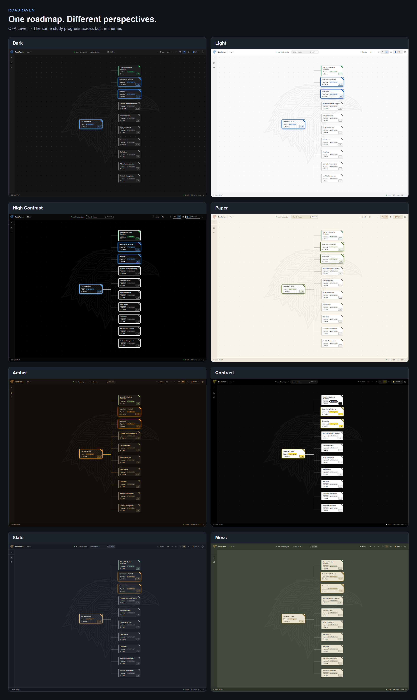
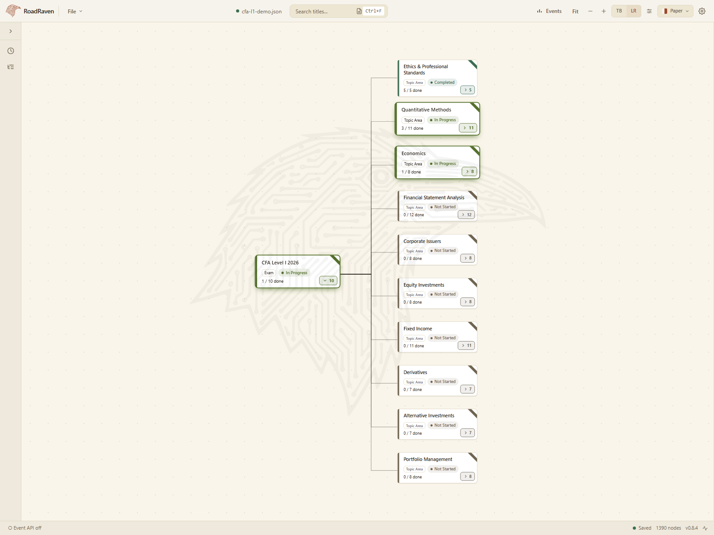
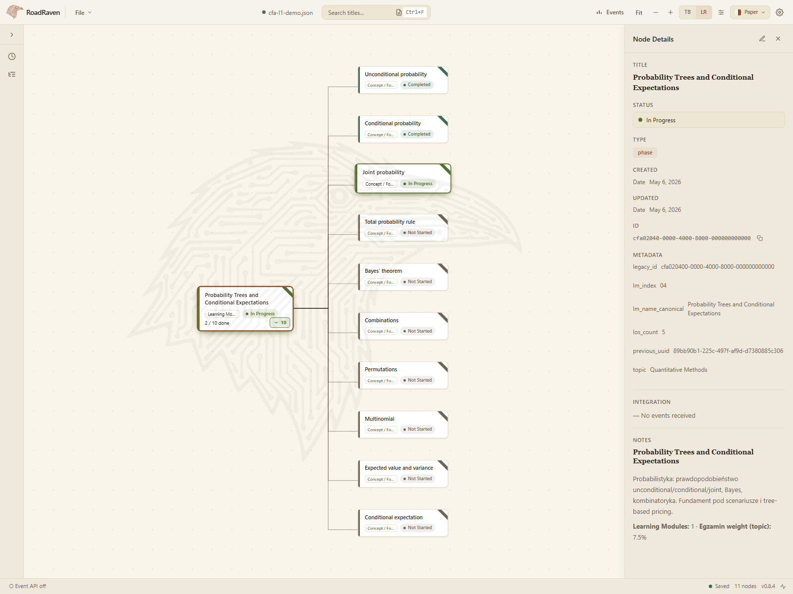

# Screenshot POC

From the repository root:

```sh
bun run screenshots:cfa

# A different theme
bun run screenshots:cfa --theme light

# Four themes (Dark, Light, Amber, Moss) and a labeled 2×2 collage
bun run screenshots:cfa --collage

# Choose the themes and tile order (quote comma lists in PowerShell)
bun run screenshots:cfa --theme "paper,slate,contrast,moss" --collage

# Capture all eight built-in themes and a two-column collage
bun run screenshots:cfa --theme all --collage
```

Available theme IDs: `dark`, `light`, `high-contrast`, `paper`, `amber`,
`contrast`, `slate`, `moss`. Use `--help` for the command summary.
The screenshot default remains `dark`; the app's own default is `amber`.

Requires the workspace dependencies (`bun install`) and Playwright Chromium.
If Chromium is missing, install it from `packages/desktop` with
`bunx playwright install chromium`.

The command starts an isolated Vite server on port **5175**, captures the real
RoadRaven UI in headless Chromium, and stops the server when finished. It does
not connect to the running desktop app. No additional packages are needed.

## Outputs

- `cfa-l1/overview.png` — all ten CFA topics, with deeper branches collapsed.
- `cfa-l1/quant-details.png` — the active Quantitative Methods module as a
  focused subtree, with its original tasks and the details panel open.
- `cfa-l1/cfa-l1-demo.json` — the complete, self-contained roadmap with demo
  progress. Open this in RoadRaven to explore the same data.
- `cfa-l1/overview-<theme>.png` and `cfa-l1/quant-details-<theme>.png` — each
  requested theme, preserved under its own filename.
- `cfa-l1/theme-collage.png` — labeled overview captures arranged in two
  columns, generated only with `--collage`.

The unqualified `overview.png` and `quant-details.png` show the **first theme**
requested in the latest run. The left sidebar is collapsed to its icon rail in
every app capture; the detail shot also opens the right-hand node panel.

The source is `samples/cfa-l1-roadmap.json`, including its linked topic files.
Progress is staged in memory: Ethics is completed, Quantitative Methods has
three completed modules and one active module, Economics has one completed
module and one active module, and the remaining topics are not started.
These are illustrative statuses, not actual study progress. Source files are
checked byte-for-byte after capture and are never saved by the generator.

Captures use a 1600 × 1200 viewport, reduced motion, en-US
locale, UTC, and wait for fonts and card geometry to settle. The images reflect
the current working tree, including unreleased UI changes. Exact font rendering
can differ across operating systems.

Regeneration overwrites the demo JSON, the two unqualified images, and the
requested theme images. A collage is overwritten only when requested. Images
from other themes/runs remain on disk. The existing root README images are not
replaced. To use the overview in the root README:

```md

```

## Preview







## How the script works

The tooling is in `packages/desktop/scripts/screenshots/`:

1. **`run.ts`** reads `--theme`/`--collage`, validates IDs against the app's
   built-in theme registry, and launches Playwright with those choices.
2. **`playwright.config.ts`** starts Vite on port 5175 and creates a fresh
   Chromium browser context with fixed viewport, locale, and timezone.
3. **`cfa.spec.ts`** reads the CFA JSON, resolves its linked topic files with
   the app's resolver, and stages repeatable demo statuses on that copy.
4. **`loadScene()`** runs code inside the browser via `page.evaluate()`.
   It imports the app's existing stores through Vite, loads the roadmap,
   sets the layout/collapsed branches, and calls `setTheme(themeId)`.
   React renders the actual components; the normal theme provider applies
   the chosen theme's CSS tokens. The script checks `<html data-theme>`.
5. The script clicks the real **Collapse sidebar** button and waits for its
   width animation before framing. **`capture()`** waits for fonts, invokes
   Fit to view, waits for card geometry to settle, and saves a PNG.
6. **`collage.ts`** puts the overview PNGs into a separate HTML/CSS grid with
   labels, waits for images to decode, then captures that page as one image.
   It uses the same browser tooling, with no additional image library.

This captures the web UI, not the native desktop window. The renderer uses
its existing browser-development fallback, so this process cannot save into
the running desktop session or change its theme. The script also checks for
uncaught browser errors and verifies source files stayed byte-identical.
