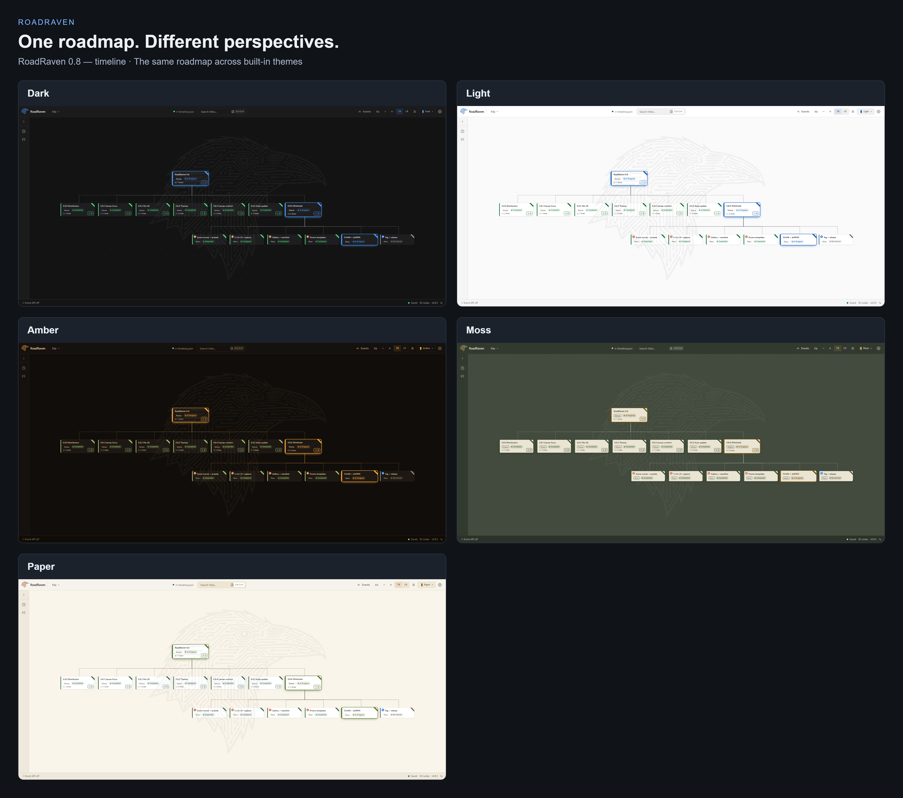
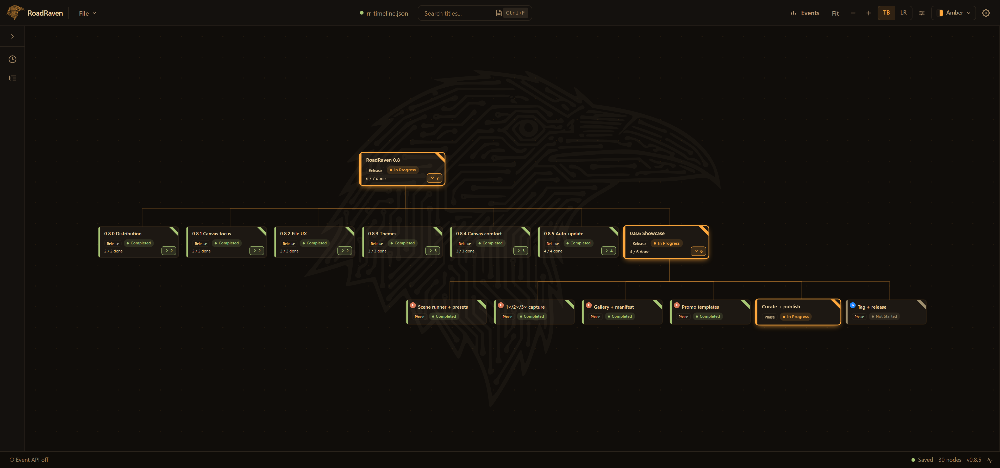
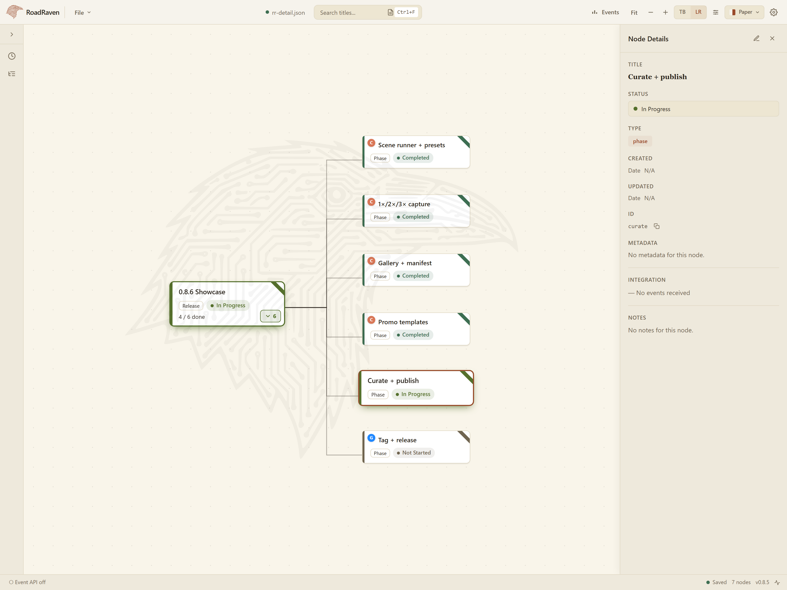

# Screenshots

The tool that generates every screenshot in this folder and the promo/social
cards derived from them. It captures the real RoadRaven UI in headless
Chromium — never the native desktop window — so what you see here is what
ships.

From the repository root:

```sh
bun run screenshots                                        # rr-timeline, dark theme, preview quality
bun run screenshots --scene rr-detail                      # a different scene
bun run screenshots --theme amber                           # a different theme
bun run screenshots --theme "amber,moss" --collage           # two+ themes, plus a labeled collage (quote comma lists in PowerShell)
bun run screenshots --quality standard                       # 2x capture — see Qualities below
bun run screenshots --format social-card                      # also compose a promo card from each capture
bun run screenshots --scene all --theme all                    # every scene x every theme
bun run screenshots --gallery-only                              # rebuild artifacts/showcase/index.html from what's already on disk
bun run screenshots --publish "capture:rr-timeline:amber"        # copy named outputs into screenshots/ — see Publishing below
bun run screenshots:cfa                                          # shortcut for --scene cfa-overview
bun run screenshots --help
```

Requires the workspace dependencies (`bun install`) and Playwright's Chromium.
If Chromium is missing, install it from `packages/desktop` with
`bunx playwright install chromium`. On Windows PowerShell, quote any
comma-separated list (`--theme`, `--scene`, `--format`, `--publish`) in double
quotes — an unquoted comma list can be split by the shell before the script
sees it.

## Scenes

| id | what it shows | fixture |
| --- | --- | --- |
| `rr-timeline` | RoadRaven's own 0.8 release line, collapsed to one row per version with the in-flight release as the focal card | `roadraven` |
| `rr-detail` | The in-flight release as its own subtree, with its active phase selected and the detail panel open | `roadraven` |
| `cfa-overview` | A CFA Level I study plan, all ten topics collapsed to one level | `cfa` |

`rr-timeline` and `rr-detail` show plugin attribution badges (`claude-code`,
`github-actions`); `cfa-overview` shows none. The `roadraven` fixture is
`fixtures/roadraven-08.json` — see "Editing the demo content" below. The
`cfa` fixture resolves `samples/cfa-l1-roadmap.json` (with its linked topic
files) through the app's own `$ref` resolver, then stages a deterministic
demo progression in memory only: Ethics complete; Quantitative Methods three
modules complete plus one active; Economics one module complete plus one
active. Source files are checked byte-identical after every capture and are
never saved by the generator.

## Themes

Theme ids come from the app's built-in registry — the single source of
truth is `THEME_IDS` in `packages/desktop/src/mainview/themes/index.ts`. In
picker order, today that is: `dark`, `light`, `high-contrast`, `paper`,
`amber`, `contrast`, `slate`, `moss`. The screenshot default is `dark`; the
app's own default is `amber`.

## Qualities

A quality is a run-level device scale factor; CSS geometry never changes.

| quality | factor | pixel size at `rr-detail`/`cfa-overview`'s viewport (1600x1200) |
| --- | --- | --- |
| `preview` (default) | 1x | 1600 x 1200 |
| `standard` | 2x | 3200 x 2400 |
| `ultra` | 3x | 4800 x 3600 |

`rr-timeline` uses its own wider viewport (1920x900); the same factors apply
to it.

## Promo formats

`--format` composes each requested capture into a promo template
(`promo.ts`), rendered twice: once at the format's exact delivery size, and
once at 2x as a `@2x` retina master alongside it.

| format | delivery size | intended use |
| --- | --- | --- |
| `readme-hero` | 1600 x 900 | README header image |
| `social-card` | 1200 x 630 | Link preview (Open Graph, X, LinkedIn) |
| `square-feature` | 1080 x 1080 | Square feed post |

The words on each card come from `fixtures/promo-copy.json`: two drafted
options per format (`headline`, `subline`, optional `highlights`, optional
`showVersion`). `picked` (`0` or `1`) chooses which one renders, and the text
itself — this tool never edits that file. Setting `showVersion: true` and/or
adding `highlights` turns a card into more of a release announcement (a
version badge above the headline, up to three bullet highlights) rather than
a plain feature card.

## Output layout

Everything a run produces lives under the gitignored `artifacts/showcase/`:

```
artifacts/showcase/
├── captures/<quality>/<scene>/<theme>.png   one capture per quality x scene x theme
├── captures/<quality>/run.json              sha, browser, capturedAt, scenes, themes of that quality's last run
├── captures/<quality>/cfa-l1-demo.json      the CFA fixture as a portable roadmap (written whenever cfa-overview is captured)
├── collage/<quality>/<scene>.png            the --collage output, for the FIRST requested scene
├── promo/<format>/<scene>-<theme>.png       the delivery PNG (exact target size)
├── promo/<format>/<scene>-<theme>@2x.png    the same card at 2x, for a retina archive
├── manifest.json                            buildGallery's machine-readable index
└── index.html                               the gallery: every quality x scene x theme cell, thumbnails link to the full image
```

Nothing under `artifacts/` is ever committed. `--publish` is the only bridge
from there into the tracked `screenshots/`.

## Publishing

A capture run never touches `screenshots/` — `artifacts/showcase/` is scratch
space you review before anything is tracked. The loop:

1. Capture: `bun run screenshots --scene <ids> --theme <ids> [--quality <id>] [--format <ids>] [--collage]`.
2. Review: open `artifacts/showcase/index.html` in a browser and compare cells across quality/scene/theme.
3. Decide what is worth publishing.
4. Publish: `bun run screenshots --publish "<pick>[,<pick>...]"`. Each pick copies one file to a stable, explicit destination:
   - `capture:<scene>:<theme>[:<quality>]` → `screenshots/<scene>-<theme>.png` (quality defaults to `standard`)
   - `promo:<format>:<scene>:<theme>` → `screenshots/promo/<format>-<scene>-<theme>.png` (the delivery PNG, not the `@2x` master)
   - `collage:<scene>[:<quality>]` → `screenshots/collage-<scene>.png` (quality defaults to `standard`)

   Omit `--scene` and only `--publish` runs; nothing is re-captured, so this
   publishes straight from whatever is already on disk in
   `artifacts/showcase/`. A missing source (nothing captured yet at that
   scene/theme/quality) throws, naming the pick.
5. Review again: `git status --short -- screenshots/`.
6. Commit with explicit paths (`git add screenshots/<file> ...`), never a bare
   `git add screenshots/` — that would silently pick up anything else sitting
   in the folder.

Destinations are derived from the pick, not the source path, so republishing
the same pick at a different quality overwrites the same tracked file rather
than adding a new one.

## Editing the demo content

`fixtures/roadraven-08.json` is a normal roadmap file — open it in RoadRaven,
edit titles, statuses, or notes, save, and re-run the capture. Card counts,
layout, and collapse state are all derived from the file at capture time; no
code change is needed for a content edit. Two node ids are referenced by
`fixtures/index.ts` as fixed anchors (`v0-8-6` as `"current"`, `curate` as
`"currentPhase"`) — renaming or removing either breaks `rr-timeline`/
`rr-detail` until `fixtures/index.ts` is updated to match.

## Adding a scene

Add an entry to `SCENES` in `scenes.ts` (`ScenePreset`):

- `id`, `title` — used in `--scene`, the capture folder name, pick grammar, and the gallery.
- `fixture` — which fixture builder to load (`"roadraven"` or `"cfa"`; see `fixtures/index.ts`).
- `subtreeRoot?` — re-root the capture at this node (a literal id or a fixture anchor) instead of the fixture's own root.
- `layout` — `"TB"` or `"LR"`.
- `collapseDepth?` — collapse every node at this depth. Mutually exclusive with `collapsed`.
- `collapsed?` — collapse exactly these node ids/anchors. Mutually exclusive with `collapseDepth`.
- `knobs?` — per-scene layout knob overrides (e.g. `siblingGap`, `depthGap`); omitted keys keep the app's defaults.
- `selectedNode?` — open this node's detail panel.
- `viewport` — `{ width, height }` for this capture.
- `focal?` — the node id/anchor whose card centre becomes the promo crop's focal point; unused by a plain capture.
- `attribution` — `"none"`, or a list of plugin ids that must show at least one badge (checked by the spec).

Then `bun run screenshots --scene <newId> --theme dark` to check it renders
before deciding whether it needs a `--collage`/`--format` pass or a
`--publish` pick.

## What's deliberately not here

- **CI.** This is a manual, local tool; nothing regenerates screenshots automatically on a push or a release.
- **Auto-commit.** `--publish` only copies files into `screenshots/`; committing them is always a manual, explicit `git add`.
- **A committed contact sheet.** `artifacts/showcase/index.html` is the browsing view for a local review; it is gitignored and rebuilt on every run, never checked in.

## How the script works

The tooling is in `packages/desktop/scripts/screenshots/`:

1. **`cli.ts`** parses `--scene`/`--theme`/`--quality`/`--collage`/`--format`/`--gallery-only`/`--publish`, validating every id against the real catalogs (`scenes.ts`, the app's theme registry, `quality.ts`, `promo.ts`) — the ids are imported, never re-typed. `--publish` picks are validated here too, by calling into `publish.ts`.
2. **`run.ts`** launches Playwright (`bun run test:e2e` under the hood — never a bare `bun` script) unless the request is `--gallery-only` or a publish-only `--publish` (no `--scene`); it then rebuilds the gallery from disk and, if `--publish` picks were given, calls `publish.ts` and prints each copy.
3. **`showcase.spec.ts`** is the one Playwright spec: it boots the real app, builds the requested fixtures (`fixtures/index.ts`), and for every scene x theme calls `sceneLoader.ts`'s `loadScene()` inside the browser via `page.evaluate()` — importing the app's own stores through Vite, loading the fixture schema, setting layout/collapse/selection, and calling `setTheme()`. React renders the real components; the spec checks `<html data-theme>` and the rendered card count before capturing.
4. **`sceneLoader.ts`**'s `captureScene()` fits the camera, polls card geometry until it settles (no fixed sleep), and saves a PNG at the requested quality's device scale factor (`quality.ts`).
5. If `--format` was requested, **`promo.ts`**'s `renderPromo()` composes that capture into a promo template — headline/subline/highlights from `copy.ts` / `fixtures/promo-copy.json` — at both the format's delivery size and a 2x master.
6. If `--collage` was requested, **`collage.ts`**'s `captureCollage()` puts the first requested scene's per-theme captures into a separate labeled grid page and screenshots that.
7. **`gallery.ts`**'s `buildGallery()` scans `artifacts/showcase/captures/` for every quality x scene x theme PNG actually on disk (not just this run's) and writes `manifest.json` + `index.html`.
8. **`publish.ts`**'s `publishOutputs()` — called from `run.ts`, never reimplemented elsewhere — copies exactly the picks named on `--publish` from `artifacts/showcase/` to their stable, explicit destination under `screenshots/`. Nothing else in this pipeline writes there.

This captures the web UI, not the native desktop window. The renderer uses
its existing browser-development fallback, so this process cannot save into
the running desktop session or change its theme. The spec also checks for
uncaught browser errors and verifies every fixture's source files stayed
byte-identical after capture.

## Preview






